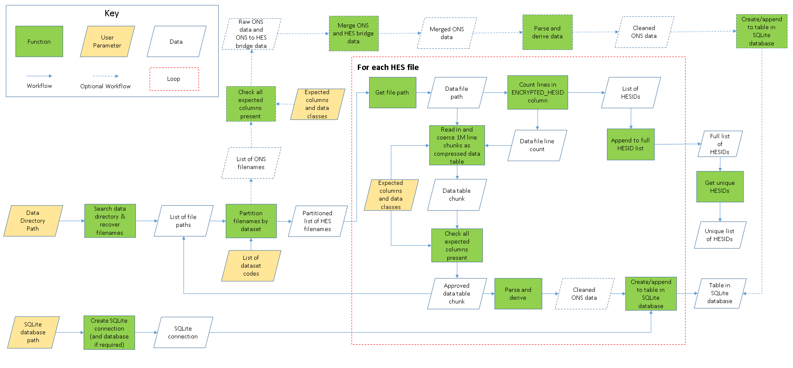

The HES pipeline tool has four user parameters; a path to a directory where the
data is stored, a location where an SQLite database can be created or is 
located, a vector of dataset codes and the path to a CSV of expected columns 
(see [Usage](README.md#usage) for more information). 

1. Load a csv of expteced column names, dataset label and data type 
([for example](tests/dummy_data/example_expected.csv)).
2. Using the data directory path, recover all filenames therein.
3. Create a SQLite connection and database at the database path.
4. Using a set list of dataset codes, the filenames are partitioned into their 
respective datasets.
5. Iterate over each dataset:
    1. Iterate over each file in a dataset:
        1. Read in the ID column for the file
        2. Count the number of rows
        3. Divide the row count into 1 million row chunks
        4. Store the first row as the header for the database table
        5. For each 1 million row chunk in a file:
            1. Read in the data, coercing data types
            2. Confirm all headers are present
            3. Write the data to a table in the SQLite database
            4. Log file name, number of records and processing time
    2. Concatenate the list of IDs
    3. Log dataset name, total number of records and total processing time
6. Store IDs as a table in the SQLite database

The following diagram describes this process as a flowchart. Functions are 
marked as green squares, user parameters to be input to the pipeline are gold
parallelograms and data structures are white parallelograms. A data structure
with no exit workflow is also an output. The workflow is indicated by the 
direction of the blue arrows, while the looping section is demarked by the 
hashed red line. 

