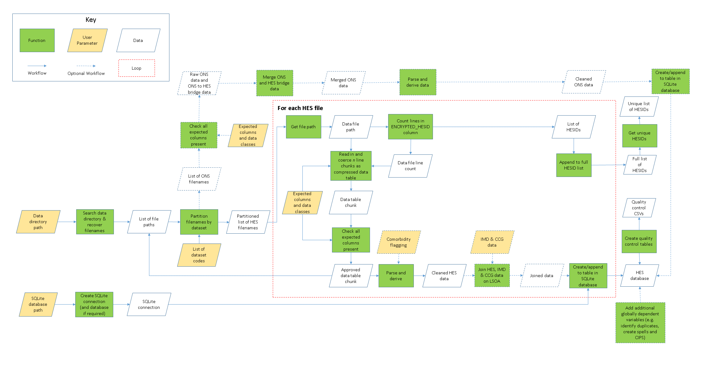

The HES pipeline tool has three user parameters; a path to a directory where the
data is stored, a location where an SQLite database can be created or is located
and a vector of dataset codes (see [Usage](README.md#usage) for more 
information). 

1. Using the data directory path, recover all filenames therein.
2. Create a SQLite connection and database at the database path.
3. Using a set list of dataset codes, the filenames are partitioned into their 
respective datasets.
4. Iterate over each dataset:
    1. Iterate over each file in a dataset:
        1. Read in the ID column for the file
        2. Count the number of rows
        3. Divide the row count into 1 million row chunks
        4. Store the first row as the header for the database table
        5. For each 1 million row chunk in a file:
            1. Read in the data
            2. Clean the data (TBD)
            3. Write the data to a table in the SQLite database
    2. Concatenate the list of IDs
5. Store IDs as a table in the SQLite database

The following diagram describes this process as a flowchart. Functions are 
marked as green squares, user parameters to be input to the pipeline are gold
parallelograms and data structures are white parallelograms. A data structure
with no exit workflow is also an output. The workflow is indicated by the 
direction of the blue arrows, while the looping section is demarked by the 
hashed red line. 

